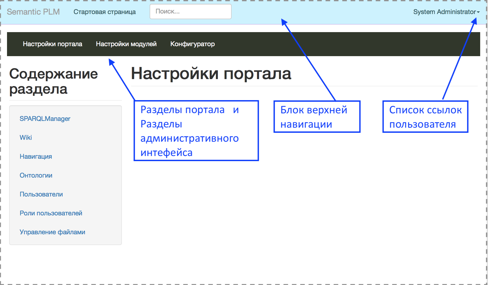
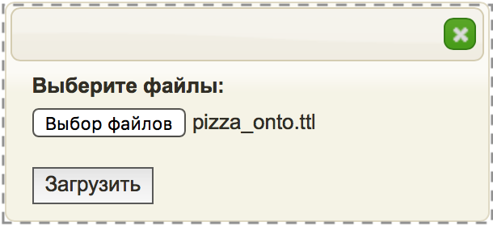
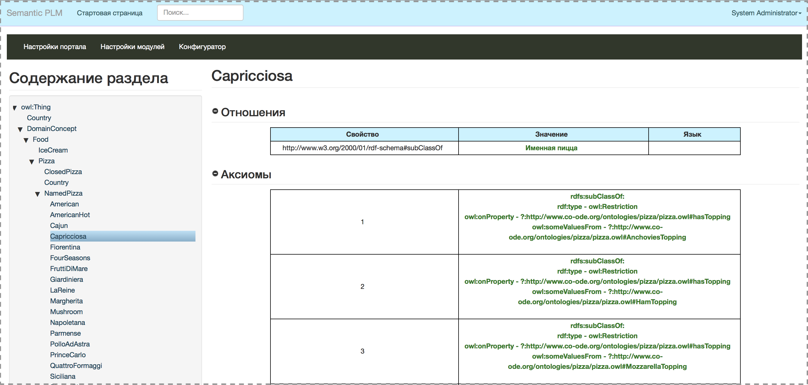
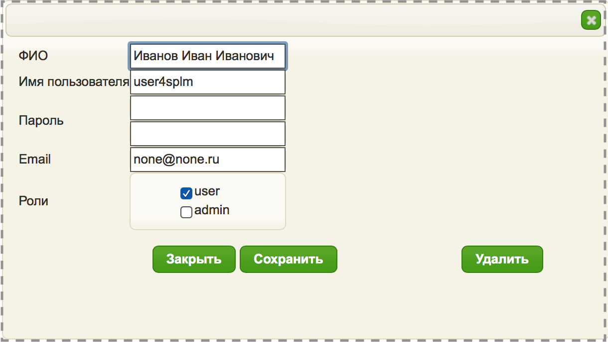
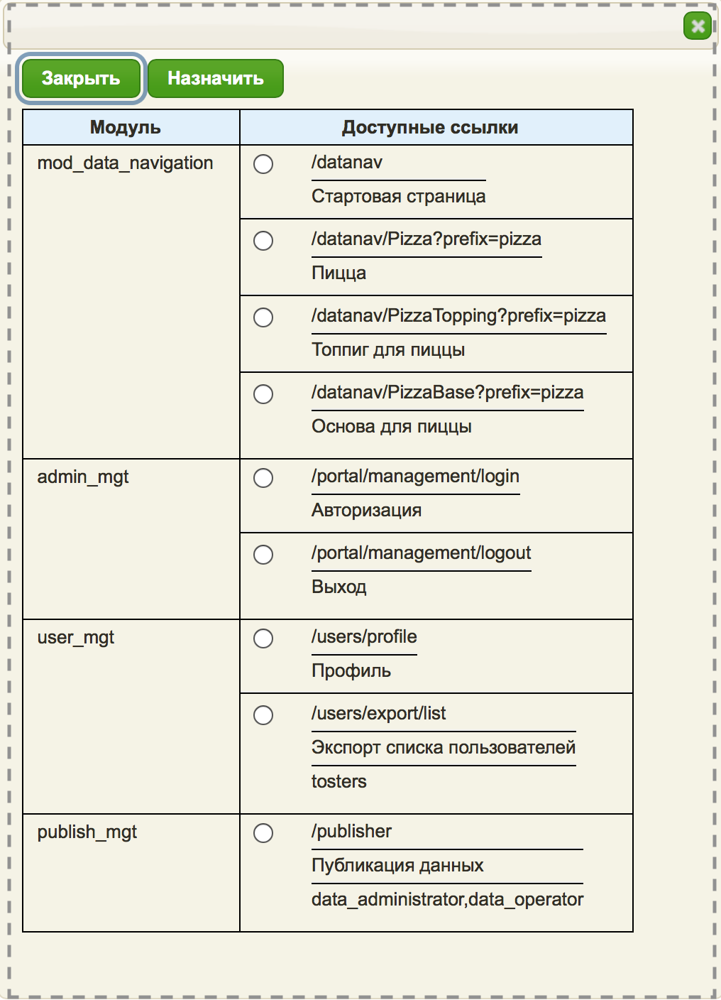
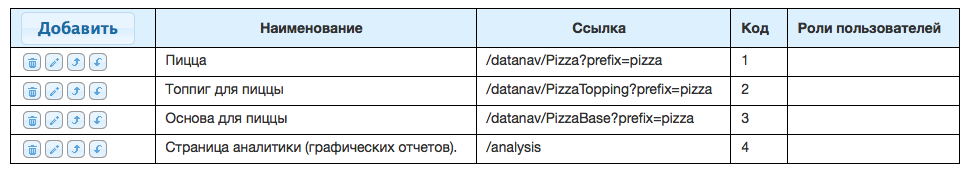
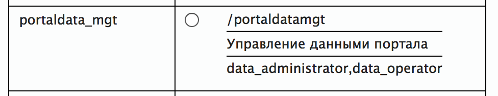
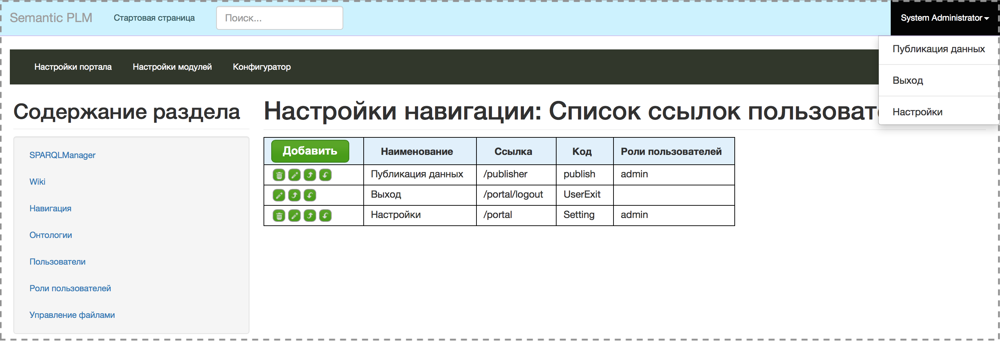
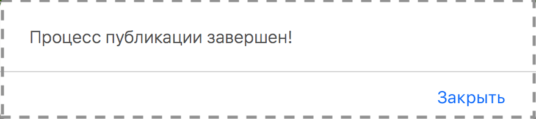
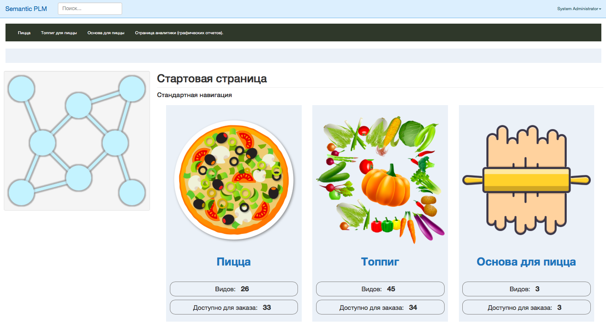

.. highlight:: shell

============
Первый запуск приложения
============

Настройка портала
------------
После запуска приложения по адресу http://127.0.0.1:5001/portal и ввода логина и пароля откроется раздел **"Настройки портала"**

Выполним настройки портала на примере тестовых данных, расположенных в папке **"test_data"**.



1. Шаг
`````````````

Загрузите отнтологию через раздел **"Онтологии"**.

.. image:: images/screenshot_7.png
  :width: 60 %
  :align: center
  
Загружаем файл "pizza_onto.ttl".



В итоге должно получится так:

.. image:: images/screenshot_9.png
  :width: 90 %
  :align: center

После загрузки онтологии ее можно посмотреть кликнув кнопку с изображением цепочки.



2. Шаг
`````````````

Разверните один из вариантов TripleStore (**Apache Jena**, **Alegrograph**, **Blazegraph**).

https://jena.apache.org

https://franz.com

https://blazegraph.com

Для развертывания выбранного хранилища триплетов используйте соответствующую инструкцию.

Создайте пустой репозиторий.

3. Шаг
`````````````

Настройте подключение к TripleStore через **"Конфигуратор"** -> **"Хранилище"**.


В секциях **"Accounts"**, **"Drivers"** и **"EndPoints"** укажите данные для авторизации, тип выбранного хранилища и URL с адресом созданного на предыдущем шаге репозитория.

для **Jena** тип **fuseki**

для **Alegrograph** тип **agraph**

для **Blazegraph** тип **blazegraph**

.. image:: images/screenshot_12.png
  :width: 50 %
  :align: center

4. Шаг
`````````````

Загрузите картинки через раздел **"Управление файлами"**.

.. image:: images/screenshot_13.png
  :width: 70 %
  :align: center

Создайте папку с именем "images".


Выберите созданную папку, кликнув по ней мышью и загрузите в нее файлы с картинками. Должно получится так:

.. image:: images/screenshot_15.png
  :width: 70 %
  :align: center
  
5. Шаг
`````````````

Настройте нужные роли через раздел **"Роли пользователей"**.

Добавляем роли **"user"** и **admin**. Последняя будет использована для загрузки данных. Должно получиться так:

.. image:: images/screenshot_16.png
  :width: 70 %
  :align: center

.. note:: Если в описании модулей (в соответствующих файлах **dublin.ttl**) указаны нужные для работы модулей роли, то при настройке они будут выданы в качестве подсказки.

.. hint:: Если право на загрузку данных в TripleStore необходимо дать отдельному пользователю, например **data_manager**, то необходимо создать соответствующую роль.

6. Шаг
`````````````

Настройте пользователей через одноименный раздел.

Добавляем пользователей и назначаем им ранее созданные роли:



В итоге дожно получиться так:

.. image:: images/screenshot_18.png
  :width: 70 %
  :align: center

7. Шаг
`````````````

Настройте пользовательское меню через раздел **"Навигация"**.

В этом разделе можно настроить разные меню

.. image:: images/screenshot_19.png
  :width: 70 %
  :align: center

Настроим блок верхней навигации, выбрав кнопку с шестеренкой:

.. image:: images/screenshot_20.png
  :width: 70 %
  :align: center

Далее, по кнопке **Выбрать** будет доступен перечень ссылок, которые были сформированы на основании описаний модулей в соответствующих им файлах **"dublin.ttl"**.
Выбираем пункт **"Стартовая страница"**. Далее **"Назначить"**.



Должно получится так:

.. image:: images/screenshot_22.png
  :width: 70 %
  :align: center

Сохраняем.

Далее, по аналогии, настраиваем блок **"Разделы портала"**.

.. image:: images/screenshot_23.png
  :width: 70 %
  :align: center

Должно получиться так:



Так же настраиваем блок **"Список ссылок пользователя"**.

В этом блоке важно добавить раздел



Этот Инструмент публикации данных семантических данных, представленных в TTL формате.

.. warning:: При настройке меню не забываем указать роль, которой доступен соответствующий пункт меню.

Результат должен получиться таким:



.. note::Пправа на загрузку данных предоставлены пользователю с ролью **admin**, которая была создана на Шаге 5.

.. note:: Настроенный список меню станет доступен соответствующему пользователю в правом верхнем углу портала как показано на картинке.

7. Шаг
`````````````

Загрузка данных - это последний шаг, завершающий настройку портала.

От имени администратора портала, или пользователя, которому в ходе настройки были делегированы соответствующие права, загрузите в TripleSore данные (**"pizza_data.ttl"**).

.. caution:: Файлы зарегистрированных онотологий загружаются в TripleStore "по умолчанию". Включать их в публикацию не нужно!

Нажимаем кнопку **"Загрузить фвйлы"**, а потом **"Опубликовать"**.

.. image:: images/screenshot_26.png
  :width: 70 %
  :align: center

По окончании публикации данных должно появиться сообщение о завершении процесса:



Навигация по тестовым данным.
------------

Теперь у администратора портала в **"Верхнем меню"** появилась ссылка **"Стартовая страница"** и можно перейти по ней в навигацию по  тестовым данным,
или выйти из портала и зайти от имени только что созданного пользователя.

Если все выполнено правильно, то должна появится следующая страничка.



