.. highlight:: shell

============
Первый запуск приложения
============

Настройка портала
------------
После запуска приложения по адресу http://127.0.0.1:5001/portal и ввода логина и пароля откроется раздел "Настройки портала" см рис.

Выполним настройки портала на примере тестовых данных, расположенных в папке "test_data".

.. image:: screenshot_6.png

1) Загрузите отнтологию через раздел "Онтологии":

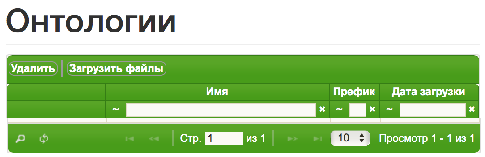

Загружаем файл "pizza_onto.ttl"

В итоге должно получится так:

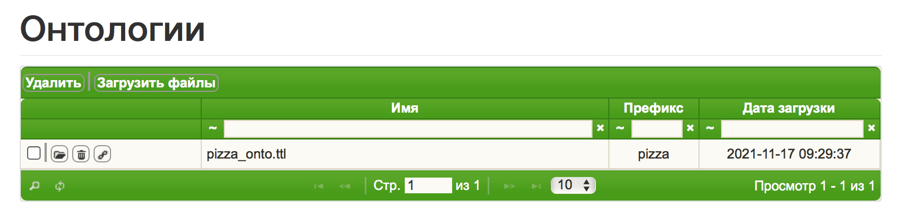

После загрузки онтологии ее можно посмотреть кликнув кнопку с изображением цепочки.

.. image:: screenshot_10.png

2) Разверните один из вариантов TripleStore (Apache Jena, Alegrograph, Blazegraph) и загрузите в него данные и онтологию:

https://jena.apache.org

https://franz.com

https://blazegraph.com

Для развертывания выбранного хранилища триплетов используйте соответствующую инструкцию.

Создайте пустой репозиторий

3) Настройте подключение к TripleStore через "Конфигуратор" -> "Хранилище".

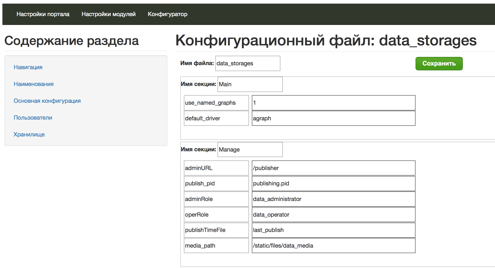

далее в секциях "Accounts", "Drivers" и "EndPoints" надо указать соответственно данные для авторизации, тип выбранного хранилища и URL с адресом нужного репозитория (базы)

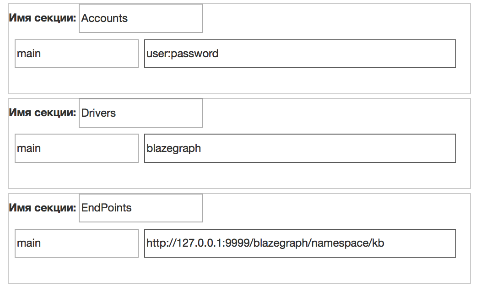

4) Загрузите картинки через раздел "Управление файлами":

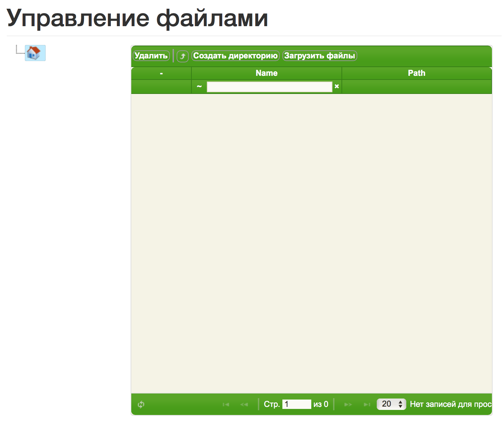

создайте папку с именем "images"

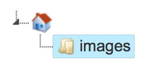

выберите созданную папку, кликнув по ней мышью и загрузите в нее файлф с картинками. Должно получится так:

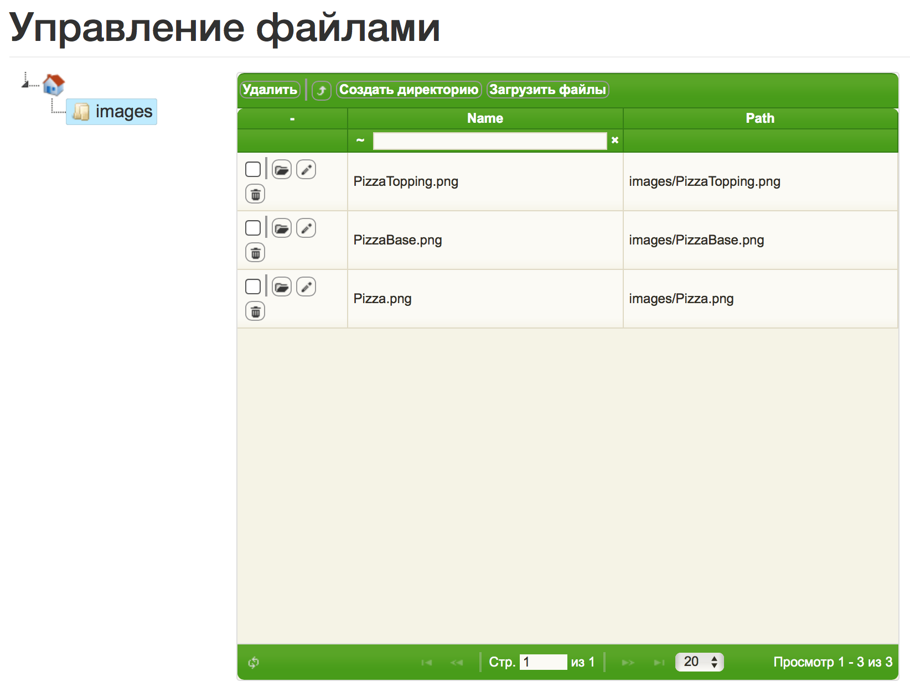

5) Настройте меню через раздел "Навигация":

В этом разделе можно настроить разные меню, см рис.

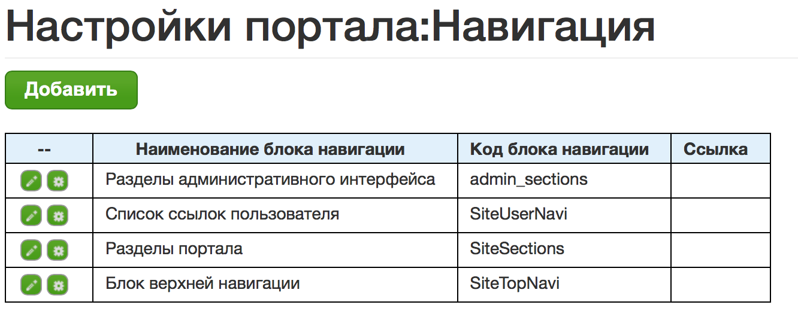

Настроим блок верхней навигации, выбрав кнопку с шестеренкой:

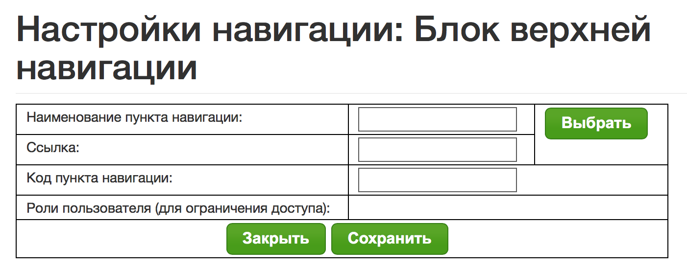

Далее, по кнопке выбрать будет доступен перечень ссылок, которые были сформированы на основании описания модуля в файле "dublin.ttl".
Выбираем пункт "Стартовая страница". Далее "Назначить"

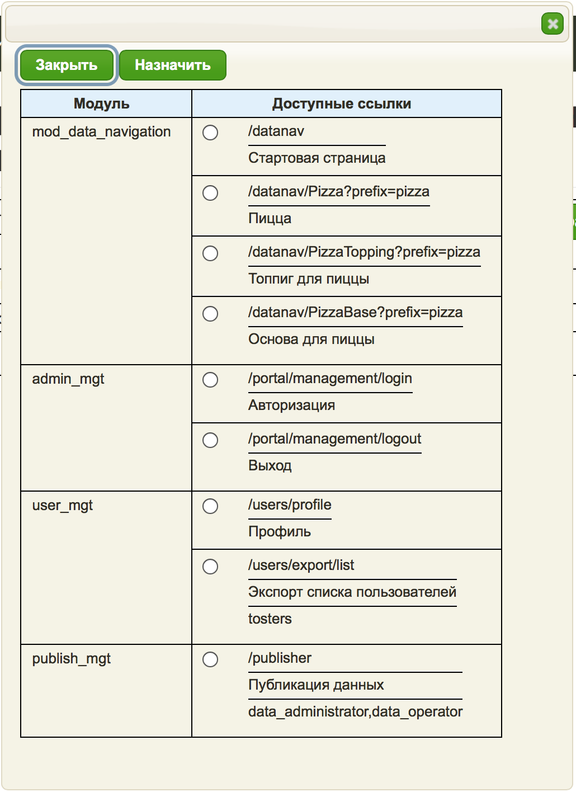

Должно получится так:

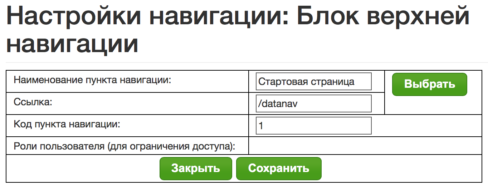

Сохраняем.

Далее, по аналогии, настраиваем блок "Разделы портала"

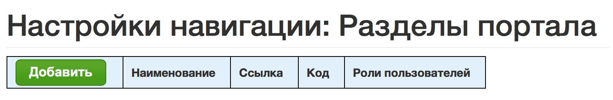

Должно получиться так:

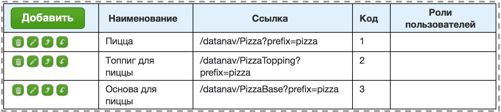

6) Настройте нужные роли через раздел "Роли пользователей":

Добавляем роль с именем "user". Должно получиться так:

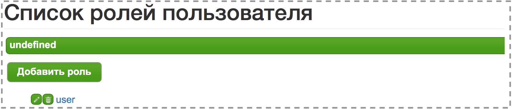

Если в описании модуля (файл dublin.ttl) указы роли, то при настройке они будут выданы в качестве подсказки.

7) Настройте пользователей через одноименный раздел:

Добавляем пользователя и назначаем ему ранее созданную роль:

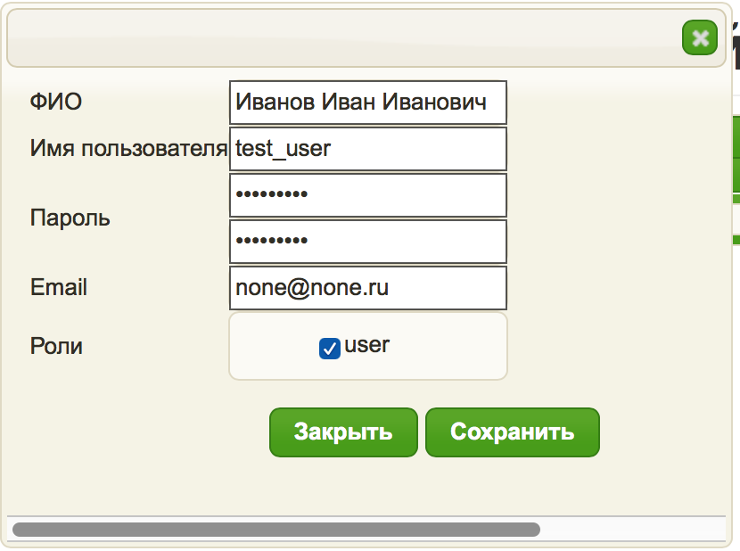

В итоге дожно получиться так:

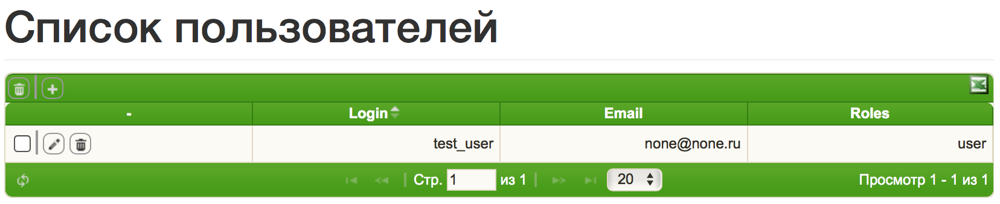

Настройка закончена.
------------

Теперь у администратора в "Верхнем меню" появилась ссылка "Стартовая страница" и можно перейти по ней в навигацию по данным,
или выйти из портала и зайти от имени только что созданного пользователя.

если все выполнено правильно, то должна появится следующая страничка.

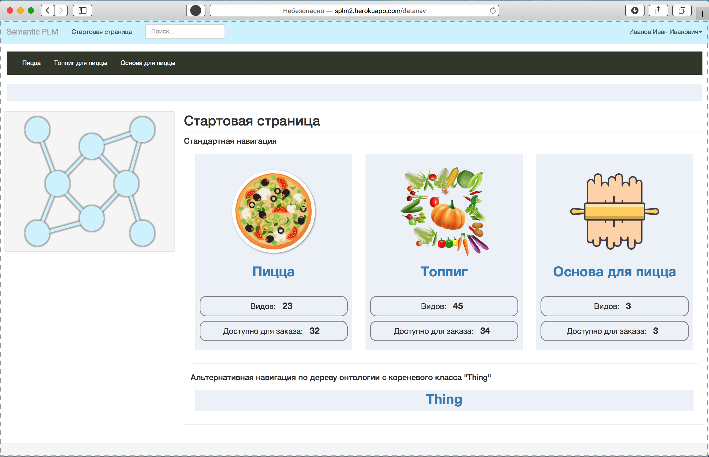