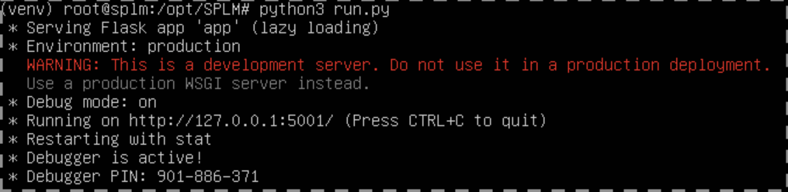

.. highlight:: shell

============
Установка
============
Прежде чем начать установку уведитесь что у вас установлены пакеты "git" и "Apache". Если их нет, то выполните их установку.
Эту и все последующие установочные команды будем выполнять от пользователя root на примере ОС Ubuntu 18:

.. code-block:: console

    $ sudo -i
    # apt install git
    # apt install apache2
    # systemctl enable apache2

1) Загрузите исходный код с git, находясь в папке "opt":

.. code-block:: console
    
    # cd /opt/
    # git clone git://github.com/oleg-post/SPLM

и перейдите в директорию проекта:

.. code-block:: console

    # cd SPLM

2) Подготовьте виртуальное окружение VirtualEnv для Python. Желательно иметь Python 3.7 или следующий. Дополнительно смотрите: https://python-scripts.com/virtualenv. Если у вас уже есть необходиммая версия Python, то первую команду из указанных ниже можно пропустить. Создайте virtual environment:

.. code-block:: console

    # apt install python3.8
    # apt install python3-venv

После последней команды в папке "SPLM" должна появиться пака для вируальной среды с именем "venv". Разворачиваем в ней среду для соответствующей версии Python:

    # python3.8 -m venv venv
    # source venv/bin/activate
    # cd ..

4) Установите необходимые дополнительные пакеты (python dependencies):

.. code-block:: console

    # pip install -r requirements.txt

5) Запустите сервер приложения:

.. code-block:: console

    # python3 run.py
    
Если усе прошло успешно, то на экране появится следующая информация:

Для запуска приложения в рабочем режиме скорректируйте файл run.py в соответствии с документацией на Flask.
