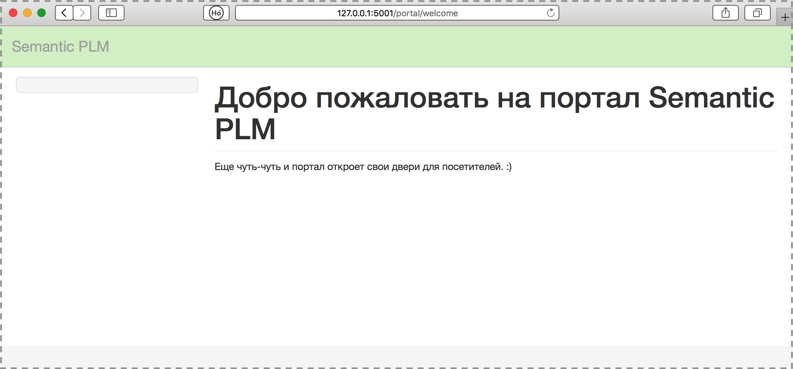
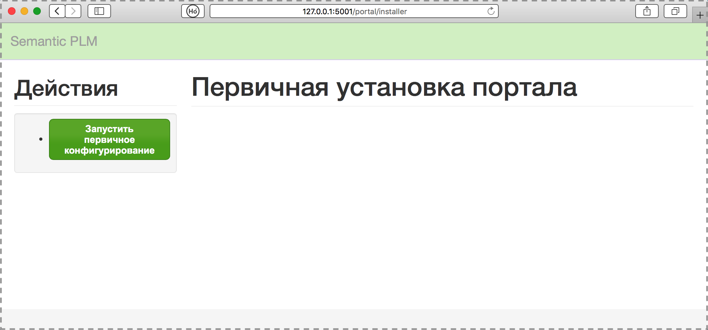
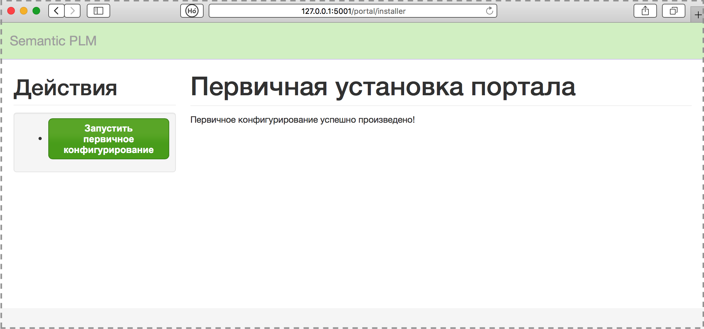

.. highlight:: shell

============
Установка
============
Прежде чем начать установку убедитесь что у вас установлены пакеты "git" и "Apache". Если их нет, то выполните их установку.
Эту и все последующие установочные команды будем выполнять от пользователя root на примере ОС Ubuntu 18:

.. code-block:: console

    $ sudo -i
    # apt install git
    # apt install apache2
    # systemctl enable apache2

1) Загрузите исходный код с git, находясь в папке "opt":

.. code-block:: console
    
    # cd /opt/
    # git clone git://github.com/oleg-post/SPLM

и перейдите в директорию проекта:

.. code-block:: console

    # cd SPLM

2) Подготовьте виртуальное окружение VirtualEnv для Python. Желательно иметь версию Python 3.7 или следующую. Дополнительно смотрите: https://python-scripts.com/virtualenv. Если у вас уже есть необходиммая версия Python, то первую команду из указанных ниже можно пропустить. Создайте виртуальную среду (virtual environment):

.. code-block:: console

    # apt install python3.8
    # apt install python3-venv
    # apt install python3.8-venv

Разворачиваем в папке "venv" среду для соответствующей версии Pythonи и активируем ее:

.. code-block:: console

    # mkdir venv
    # python3.8 -m venv venv
    # source venv/bin/activate

После выполнения последней команды в адресной строке терминала перед именем пользователя должна появиться надпись "(venv)" без кавычек. Это значит что дальнейшие команды будут выполняться в запущенной виртуальной среде.

4) Устанавливаем необходимые дополнительные пакеты для приложения (python dependencies):

.. code-block:: console

    # pip install -r requirements.txt

5) Запускаем приложение:

.. code-block:: console

    # python3 run.py
    
Если все прошло успешно, то в терминале появится информация о запуске приложения в отладочном режиме:

.. image:: screenshot_1.png

Для запуска приложения в рабочем режиме скорректируйте файл run.py в соответствии с документацией на Flask.

Если передти по указанной выше ссылке http://127.0.0.1:5001 то попадете на следующую страничку портала:

6) Запускаем установщик:

Для этого в строке браузера указываем путь http://127.0.0.1:5001/portlal/installer

в появившемся окне нажимаем единственную кнопку и ждем несколько секунд ...

Через несколько секунда дожно появится сообщение об окончании кофиигурирования:

7) теперь для входа в административную часть портала и настройки приложения укажите следующий адрес:

http://127.0.0.1:5001/portlal

для входа используйте логин manager и пароль testadmin

8) Останавливаем приложение:

Нажимаем сосчетание клавиш CTR+C

И выполняем команду:

.. code-block:: console

    # deactivate
    
Теперь надпись "(venv)" перед именем пользователя должна исчезнуть.