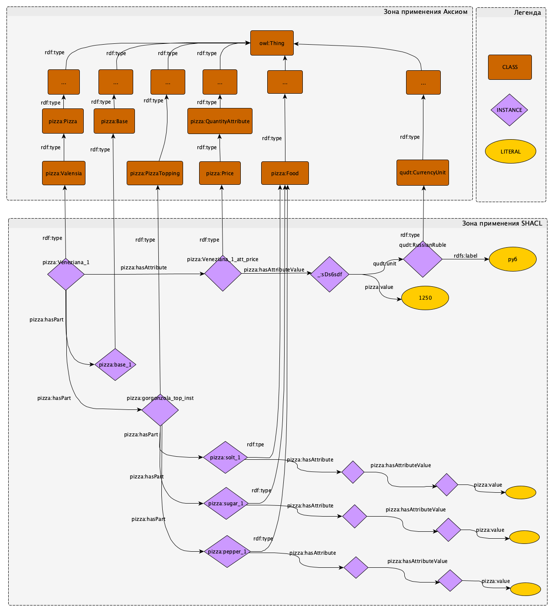

.. highlight:: shell

=======================================================================
Методология и принципы моделирования онтологии и работы с данными.
=======================================================================

Введение
----------
В мире существует множество рекомендаций по вопросу проектирования онтологий. Есть подходы, в которых
онтологии создаются экспертами, а есть и автоматизированные способы создания онтологий. Автор настоящих
рекомендаций знаком с некоторыми из них, так же с принципами моделирования данных, изложенным в ISO 15926.
Автор имеет опыт моделирования данных как в соответствии с ISO 15926, так в соответствии с Direct Semantic
(прямое использование стандартов Semantic Web от W3C).

Предлагаемая здесь методика и принципы изложены в упрощенным виде и сформулированы на основе опыта разработки
приложений для сложных инженерных проектов.

В качестве примера выбрана доработанная онтология Пиццы, так как она используется в руководстве Protégé по
созданию онтологий. Программа Protégé и руководство по ней являются хорошими средствами для освоения
технологии Semantic Web и автор тоже начинал с этого.

Методология
-------------

Так как онтологии должны разрабатываться специалистами предметной области, а не специалистами по базам данных,
то для того чтобы описать какой-либо предмет уместно опираться на ГОСТ Р ИСО 704 —2010. Так, согласно этого ГОСТ [1]_:

  «Объекты в реальном мире идентифицируются своими свойствами. Объекты абстрагируются в понятия,
  а свойства абстрагируются в характеристики, определяющие понятия. Абстрагирование — это процесс
  выделения совокупности общих признаков индивидуального набора объектов и на этой основе формирования
  понятия для указанного набора объектов. Характеристики являются спецификаторами, они сужают значение
  главного понятия (см. 5.5.2.1). Необходимо отметить, что «характеристика» является лингвистическим понятием,
  которое не следует путать с понятием «свойство» из области информационных технологий (ИТ).».

Эта цитата проиллюстрирована на рисунке ниже. Представленные на рисунке четыре понятия поясняются следующими
принципами:
 1.	каждый объект имеет одно или несколько свойств;
 2.	каждое свойство подобного вида абстрагируется в одну характеристику;
 3.	каждая характеристика является частью одного или нескольких понятий;
 4.	каждое понятие образует одну или несколько характеристик;
 5.	каждый объект абстрагируется в одно или несколько понятий.

.. image:: images/method_1.png
  :width: 90 %
  :align: center

рисунок "Основные понятия по ГОСТ Р ИСО 704-2010 [1]_"

В терминах ГОСТ [1]_ онтология представляет из себя «Абстракцию», т.е. описание реального мира. Соответственно
сразу возникает соблазн моделировать «Понятия» как «Классы» онтологии, а «Характеристики» как «Предикаты»
онтологии. Например в учебной онтологии ``pizza.owl``, из руководства по Protégé, характеристика пиццы "Острая"
задается через «Предикат» ``pizza:hasSpiciness``. Однако последнее предложение указанной выше цитаты из [1]_ и
другие источники рекомендуют моделировать «Характеристику» в виде «Класса», как самостоятельный объект,
а не в виде «Предиката». Ключевым доводом в пользу онтологического описания «Характеристик» в виде «Классов»
является сложность и размеры онтологии. Чем больше «Классов» или «Предикатов» в онтологии тем сложнее с ней работать.
Если к тысячам «Классов» онтологии добавить тысячи «Предикатов», описывающие свойства предмета, то при разработке
запросов к базе данных встает вопрос: Какие предикаты надо использовать в каких случаях?

.. hint:: Минимизируйте использование предикатов - это поможет при размещении и обращении к данным

Минимизация предикатов в онтологии существенно облегчает задачу работы с данными, как при размещении данных в
хранилище, так и при извлечении данных с помощью SPARQL-запросов. Кроме того, используя предлагаемый здесь
ограниченный набор «Предикатов» можно через последовательные запросы получать промежуточные результаты,
которые потом уточнять через новые запросы в зависимости от потребности.

Для того, что бы перейти к списку рекомендуемых предикатов дополним утверждения ГОСТ [1]_ новыми принципами:

 6. каждый объект может состоять из одних объектов и сам быть частью других объектов
 7. каждый объект может вступать/иметь отношения с другим объектом(и)

Какие же предикаты рекомендуется использовать? Опыт моделирования данных в разных предметных
областях показал, что для практически везде можно опираться на следующий набор:

 * ``rdf:type`` – это предикат указывающий на Класс, которому принадлежит «Экземпляр».
 * ``onto:PartOf`` – это предикат используется для описания отношений «часть-целое». При создани
   онтологии можно так же добавить обратное отношение ``onto:isPartOf``, не забыв при этом указать что
   оно является ``owl:inverseOf`` исходному. Это упрощает разработку запросов. Но надо не забывать, что
   тогда запрос должен выполняться с включенным ризонером.
 * ``onto:hasAttribute`` – этот предикат используется для описания характеристик «Экземпляра». Использование
   слова Attribute выбрано в связи с тем, что его написание не вызывает проблем для не англоговорящих специалистов.
 * ``onto:hasAttributeValue`` – этот предикат используется для описания значений характеристик «Экземпляра».
 * ``onto:value/rdfs:label`` - эти предикаты используются для обращения к значению характеристики «Экземпляра»,
   выраженное «Литералом», первый для числовых и типа data, а второй для строковых.

Этот набор «Предикатов» достаточен для отражения первых 6 принципов.

Для описания специфических отношений между «Понятиями» для конкретной предметной области необходимо
создавать отдельные «Предикаты», которые так же, как и «Классы», можно организовать в виде
иерархии, если такие отношения являются родственными и могут быть обощены. Состав и разнообразие
таких «Предикатов» определяется исключительно составом хранимых данных и профессиональными терминами
моделируемой предметной области. Поэтому реализация принципа №7 является творческим делом и зависит от опыта
онтолога.

Однако использование узкого набор «Предикатов» даже при широкой таксономии «Классов» делает описание
предметной области не полным. Необходимо специфицировать какие именно «Характеристики» могут быть
у каких «Понятий» и в какие отношения могут вступать «Понятия» между собой.

Для онтологического закрепления обязательного набора «Характеристики» за нужным «Классом» используются
Аксиомы. Аксиомы представляют собой те важные правила, которые действуют в моделируемой
предметной области, и фактически наличие Аксиом позволяет говорить об онтологии как о базе знаний. Однако
применение Аксиом на больших массивах данных и больших онтологиях сопряжено с огромными трудностями. Одна из
таких трудностей - последовательность применения правил логических выводов, а так же проблема отладки и управления.
Поэтому на практике широкое применение логических выводов делается с использованием ``SHACL-rules``. А вот
разрабатывать SHACL-rules лучше всего на основании аксиом. Последовательность и состав ``SHACL-rules`` можно
легко задавать в зависимости от текущей потребности.

Итак, при соблюдении предложеннего здесь подхода по описанию данных можно легко получать информацию о любом
объекте и его свойствах используя универсального набор запросов. Использование универсального набора
запросов очень важно при разработке приложений и интерфейсов отображения данных, особенно при использовании
механизма наследования. Например для разработки интерфейса приложения или бизнес-логики. Эта
особенность реализована в SP4PLM и существенно сокращает время разработки приложений.

Примеры моделирования данных и запросов к ним:
--------------------------------------------------

Сокращенные тестовые данные, использованные в примерах, приведены в конце страницы. Сделано это для удобства
их анализа. Эти тестовые данные надо использовать совместно с файлом онтологии, чтобы получить те результаты
запросов, которые приведены ниже. Полные тестовые данные можно загрузить из файла ``pizza_data.tll``.

Схематично, сокращенные тестовые данные представлены в виде графа на картинке ниже. Это принципиальная схема
того как надо приводить данные к семантическому виду.



рисунок "Схема данных и их связи между собой и классами онтологии."


1 Запрос о принадлежности заданного «Экземпляра» к «Классу»
............................................................


(1) Запрос
````````````

.. code:: sparql

    prefix pizza: <http://www.co-ode.org/ontologies/pizza/pizza.owl#>
    select ?cls ?cls_lbl {pizza:QuattroFormaggi_1 a ?cls .
                        ?cls rdfs:label ?cls_lbl .}

(1) Ответ
````````````
+-----------------------+--------------------------+
| cls                   | cls_lbl                  |
+=======================+==========================+
| pizza:QuattroFormaggi |  "Quattro Formaggi"      |
+-----------------------+--------------------------+

2 Запрос о том, из чего состоит заданный «Экземпляр»:
........................................................


(2) Запрос
````````````

.. code:: sparql

    prefix pizza: <http://www.co-ode.org/ontologies/pizza/pizza.owl#>
    select ?item ?cls {pizza:QuattroFormaggi_1 pizza:hasPart ?item .
                       ?item a ?cls .}
(2) Ответ
````````````

+-----------------------------+--------------------------+
| item                        | cls                      |
+=============================+==========================+
| pizza:base_1                | pizza:DeepPanBase        |
+-----------------------------+--------------------------+
| pizza:SweetPepperTopping_1  | pizza:SweetPepperTopping |
+-----------------------------+--------------------------+

2а Запрос о полном составе, включая части частей по всей цепочке вложенности:
................................................................................

(2a) Запрос
````````````

.. code:: sparql

    prefix pizza: <http://www.co-ode.org/ontologies/pizza/pizza.owl#>
    select ?item ?cls {pizza:QuattroFormaggi_1 pizza:hasPart* ?item .
                        ?item a ?cls .}

этот запрос отличает от предадущего наличие * после предиката pizza:hasPart

(2a) Ответ
````````````

+-----------------------------+--------------------------+
| item                        | cls                      |
+=============================+==========================+
| pizza:base_1                | pizza:DeepPanBase        |
+-----------------------------+--------------------------+
| pizza:SweetPepperTopping_1  | pizza:SweetPepperTopping |
+-----------------------------+--------------------------+
| pizza:QuattroFormaggi_1     | pizza:QuattroFormaggi    |
+-----------------------------+--------------------------+
| pizza:oil_1                 | pizza:Food               |
+-----------------------------+--------------------------+
| pizza:solt_1                | pizza:Food               |
+-----------------------------+--------------------------+
| pizza:sugar_1               | pizza:Food               |
+-----------------------------+--------------------------+

3 Запрос о том куда входит заданный «Экземпляр», т.е. кто его «Родитель»:
................................................................................

(3) Запрос
````````````

.. code:: sparql

    prefix pizza: <http://www.co-ode.org/ontologies/pizza/pizza.owl#>
    select ?parent ?cls {?parent pizza:hasPart pizza:sugar_1 .
                        ?parent a ?cls .}

(3) Ответ
````````````

+-----------------------------+--------------------------+
| parent                      | cls                      |
+=============================+==========================+
| pizza:SweetPepperTopping_1  | pizza:SweetPepperTopping |
+-----------------------------+--------------------------+

3а Запрос о том куда входит заданный «Экземпляр» до самого верхнего уровня:
................................................................................

(3a) Запрос
````````````

.. code:: sparql

    prefix pizza: <http://www.co-ode.org/ontologies/pizza/pizza.owl#>
    select ?parent ?cls {?parent pizza:hasPart* pizza:sugar_1 .
                        ?parent a ?cls .}

(3a) Ответ
````````````

+-----------------------------+--------------------------+
| parent                      | cls                      |
+=============================+==========================+
| pizza:SweetPepperTopping_1  | pizza:SweetPepperTopping |
+-----------------------------+--------------------------+
| pizza:sugar_1               | pizza:Food               |
+-----------------------------+--------------------------+
| pizza:QuattroFormaggi_1     | pizza:QuattroFormaggi    |
+-----------------------------+--------------------------+
| pizza:NamedIndividual_0     | pizza:Pizza              |
+-----------------------------+--------------------------+
| pizza:Siciliana_1           | pizza:Siciliana          |
+-----------------------------+--------------------------+

4 Запрос о составе характеристик, которые есть в хранилище для заданного «Экземпляра»:
.......................................................................................

(4) Запрос
````````````

.. code:: sparql

    prefix pizza: <http://www.co-ode.org/ontologies/pizza/pizza.owl#>
    select ?cls ?cls_lbl {pizza:QuattroFormaggi_1 pizza:hasAttribute ?att .
                        ?att a ?cls .
                        ?cls rdfs:label ?cls_lbl .}

(4) Ответ
````````````

+-----------------------------+--------------------------+
| cls                         | cls_lbl                  |
+=============================+==========================+
| pizza:Size                  | Размер                   |
+-----------------------------+--------------------------+
| pizza:Price                 | Цена                     |
+-----------------------------+--------------------------+

5 Запрос о значениях характеристик, которые есть в хранилище для заданного
.............................................................................

(5) Запрос
````````````

.. code:: sparql

    prefix pizza: <http://www.co-ode.org/ontologies/pizza/pizza.owl#>
    prefix qudt: <http://data.nasa.gov/qudt/owl/qudt#>
    select ?cls ?cls_lbl ?val ?uom_lbl {pizza:QuattroFormaggi_1 pizza:hasAttribute ?att .
                                    ?att a ?cls .
                                    ?cls rdfs:label ?cls_lbl .
                                    ?att pizza:hasAttributeValue ?att_val .
                                    ?att_val pizza:value ?val .
                                    ?att_val qudt:unit ?uom .
                                    ?uom rdfs:label ?uom_lbl .}

(5) Ответ
````````````

+-----------------------------+--------------------------+-------+-------+
| cls                         | cls_lbl                  | val   | uom   |
+=============================+==========================+=======+=======+
| pizza:Size                  | Размер                   |  310  |  мм   |
+-----------------------------+--------------------------+-------+-------+
| pizza:Price                 | Цена                     |  1250 |  руб  |
+-----------------------------+--------------------------+-------+-------+

Тестовые данные в формате Turtle
..................................

.. code:: turtle

    @prefix dc: <http://purl.org/dc/elements/1.1/> .
    @prefix owl: <http://www.w3.org/2002/07/owl#> .
    @prefix pizza: <http://www.co-ode.org/ontologies/pizza/pizza.owl#> .
    @prefix rdf: <http://www.w3.org/1999/02/22-rdf-syntax-ns#> .
    @prefix rdfs: <http://www.w3.org/2000/01/rdf-schema#> .
    @prefix skos: <http://www.w3.org/2004/02/skos/core#> .
    @prefix terms: <http://purl.org/dc/terms/> .
    @prefix xml: <http://www.w3.org/XML/1998/namespace> .
    @prefix xsd: <http://www.w3.org/2001/XMLSchema#> .
    @prefix qudt: <http://data.nasa.gov/qudt/owl/qudt#> .
    @prefix unit: <http://data.nasa.gov/qudt/owl/unit#> .

    pizza:QuattroFormaggi_1
      a pizza:QuattroFormaggi ;
      pizza:hasAttribute pizza:QuattroFormaggi_1_att_price;
      pizza:hasAttribute pizza:QuattroFormaggi_1_att_size;
      pizza:hasPart pizza:base_1 ;
      pizza:hasPart pizza:SweetPepperTopping_1 ;
      rdfs:label "Quattro Formaggi" ;
    .
    pizza:QuattroFormaggi_1_att_price
      a pizza:Price ;
      pizza:hasAttributeValue [qudt:unit unit:RussianRuble ;
                               pizza:value "1250"^^xsd:integer] ;
    .
    pizza:QuattroFormaggi_1_att_size
      a pizza:Size ;
      pizza:hasAttributeValue [qudt:unit unit:Millimeter ;
                               pizza:value "310"^^xsd:integer] ;
    .
    pizza:SweetPepperTopping_1
      a pizza:SweetPepperTopping ;
      rdfs:label "Sweet Pepper Topping" ;
      pizza:hasPart pizza:sugar_1 ;
      pizza:hasPart pizza:pepper_1 ;
      pizza:hasPart pizza:oil_1 ;
      pizza:hasPart pizza:solt_1 ;
    .
    pizza:sugar_1
      a pizza:Food ;
      rdfs:label "Сахар" ;
      pizza:hasAttribute pizza:sugar_1_att_price;
    .
    pizza:sugar_1_att_price
      a pizza:Price ;
      pizza:hasAttributeValue [qudt:unit unit:RussianRuble ;
                               pizza:value "90"^^xsd:integer] ;
    .
    pizza:pepper_1
      a pizza:Food ;
      rdfs:label "Перец" ;
      pizza:hasAttribute pizza:pepper_1_att_price;
    .
    pizza:pepper_1_att_price
      a pizza:Price ;
      pizza:hasAttributeValue [qudt:unit unit:RussianRuble ;
                               pizza:value "10"^^xsd:integer] ;
    .
    pizza:oil_1
      a pizza:Food ;
      rdfs:label "Масло" ;
      pizza:hasAttribute pizza:oil_1_att_price;
    .
    pizza:oil_1_att_price
      a pizza:Price ;
      pizza:hasAttributeValue [qudt:unit unit:RussianRuble ;
                               pizza:value "200"^^xsd:integer] ;
    .
    pizza:solt_1
      a pizza:Food ;
      rdfs:label "Соль" ;
      pizza:hasAttribute pizza:solt_1_att_price;
    .
    pizza:solt_1_att_price
      a pizza:Price ;
      pizza:hasAttributeValue [qudt:unit unit:RussianRuble ;
                               pizza:value "42"^^xsd:integer] ;
    .
    pizza:Veneziana_1
      a pizza:Veneziana ;
      pizza:hasAttribute pizza:Veneziana_1_att_price;
      pizza:hasPart pizza:base_2 ;
      pizza:hasPart pizza:gorgonzola_top_inst ;
      rdfs:label "Veneziana" ;
    .
    pizza:Veneziana_1_att_price
      a pizza:Price ;
      pizza:hasAttributeValue [qudt:unit unit:RussianRuble ;
                               pizza:value "1250"^^xsd:integer] ;
    .
    pizza:base_1
      a pizza:DeepPanBase ;
      rdfs:label "Основа в виде глубокой сковороды" ;
    .
    pizza:base_2
      a pizza:ThinAndCrispyBase ;
      rdfs:label "Тонкое и хрустящее тесто" ;
    .
    pizza:gorgonzola_top_inst
      a pizza:GorgonzolaTopping ;
      rdfs:label "Топпинг с сыром Горгонзоллла" ;
    .
    pizza:mozarella_top_inst
      a pizza:MozzarellaTopping ;
      rdfs:label "Топпинг с сыром Моцарелла" ;
    .
    pizza:tomato_top_inst
      a pizza:TomatoTopping ;
      rdfs:label "Томатный топпинг" ;
    .

.. [1] ГОСТ Р ИСО 704 —2010 «Терминологическая работа. Принципы и методы» (ISO 704:2009 Terminology work — Principles and methods)
