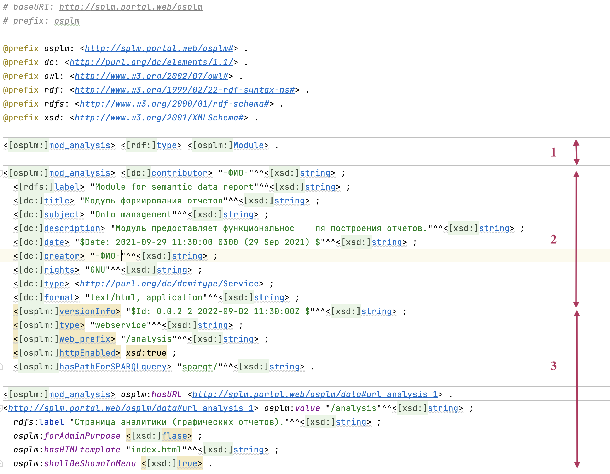
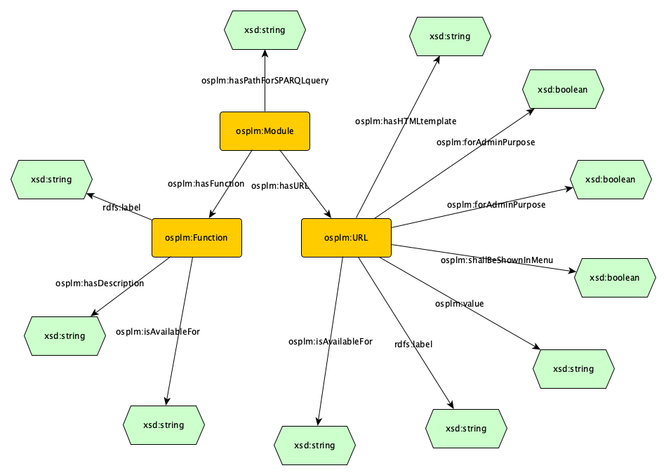

.. highlight:: shell

============
Модули
============

Модули ядра
------------

Модуль admin_mgt
`````````````````

Описание
""""""""""""

Модуль административного интерфейса портала. Предоставляет доступ к настройкам для управления порталом.

Дополнительно предоставляет функциональности:
    *	Первичная конфигурирование портла – инсталлятор;
    *	Авторизация пользователей портала;
    *	Управление режимами портала;
    *	Управление навигацией портала;
    *	Управление настройками портала.

Разделы
""""""""""""

* Настройки портала

Предоставляет возможность использовать функциональность модулей относящихся к ядру приложения.

* Конфигуратор

Предоставляет возможность изменять конфигурационные файлы портала

* Управление модулями

Предоставляет интерфейс по работе с модулями портала.

API admin_mgt
""""""""""""""

Модуль предоставляет внешний программный интерфейс для получения определенной информации по работе портала.
Доступ к API можно получить с помощью функции ``get_mod_api()`` API (``app_api``) приложения, передав в
качестве аргумента имя модуля “admin_mgt”:
::

    admin_mod_api = app_api.get_mod_api('admin_mgt')


..  automodule:: app.admin_mgt.mod_api
    :members:
    :undoc-members:
    :show-inheritance:


Модуль files_mgt
`````````````````

Модуль предоставляет функционал файлового менеджера для загружаемых файлов портала.

API files_mgt
""""""""""""""

Доступ к API можно получить с помощью функции ``get_mod_api()`` API (``app_api``) приложения, передав в
качестве аргумента имя модуля “files_mgt”:
::

    admin_mod_api = app_api.get_mod_api('files_mgt')

.. automodule:: app.files_mgt.mod_api
    :members:
    :undoc-members:
    :show-inheritance:


Модуль kv_editor
````````````````

Модуль предоставляет форму редактирования данных представленных в виде ключ-значение.

Модуль используется для редактирования файлов ... через интерфейс ...

API kv_editor
""""""""""""""

Доступ к API можно получить с помощью функции ``get_mod_api()`` API (``app_api``) приложения, передав в
качестве аргумента имя модуля “kv_editor”:
::

    admin_mod_api = app_api.get_mod_api('kv_editor')

.. automodule:: app.kv_editor.mod_api
    :members:
    :undoc-members:
    :show-inheritance:


Модуль query_mgt
`````````````````

Модуль предоставляет функциональность для работы с триплстором через SPARQL запросы.

Модуль работает с триплстором через драйвер, который настраивается в административном интерфейсе.

Для вызова модуля query_mgt из других модулей необходимо использовать следуюший код:

а. Для выполнения запроса к триплстору::

    from app.app_api import tsc_query
    tsc_query(query_code, params)

где ``query_code`` - Python.String, код sparqt запроса; params - Python.Dict, переменные определенные в sparqt запросе

б. Для создания редактора sparqt-файлов стороннего модуля::

    from app import app_api
    query_mod_api = app_api.get_mod_api('query_mgt')
    query_mod_api.create_sparqt_manager('/sparqt', mod)

где ``mod`` - объект Blueprint для стороннего модуля, тогда по url ``<mod.url_prefix>/sparqt`` создастся
интерфейс редактора sparqt-файлов

Формат запроса, передаваемый модулю query_mgt (функция tsc_query) должен быть в виде::

    tsc_query(_q, params = {})

где ``_q`` - код запроса в формате Python.String : ``<module>.<file>.<template>``,
``params`` - переменные для подстановки в запрос в формате Python.Dict : ``{<VARNAME> : <VALUE>}``

или в виде::

    tsc_query(_q)

где _q - текстовый SPARQL запрос в формате Python.String


После выполнения запроса в триплсторе модуль делает пост-обработку. Модуль query_mgt возвращает
объект типа Python.List, содержащий список объектов типа Python.Dict. В каждом объекте типа
Python.Dict содержаться пары ключ-значение запрашиваемых переменных.

В случае если запрос к базе был некорректный (или во время запроса произошла ошибка), то
возвращается объект типа Python.String c текстом ошибки. В лог ``app\data\logs\Query.log`` добавляется запись типа
error c причиной невыполнения запроса.

Если запрос к базе вернул пустой запрос, то модуль возвращает пустой объект типа ``Python.List = []``

API query_mgt
""""""""""""""

Через API модуля доступно редактирования sparqt шаблонов:
::

    admin_mod_api = app_api.get_mod_api('query_mgt')

.. automodule:: app.query_mgt.mod_api
    :members:
    :undoc-members:
    :show-inheritance:


Модуль onto_mgt
````````````````

Модуль предоставляет функциональность для работы с онтологиями.

Модуль позволяет загрузить/заменить/скачать/удалить онтологии на портале. Для каждой онтологии сохраняется
ее префикс, определенный через baseURI. Для загруженных файлов онтологий реализована навигация по онтологии.

API onto_mgt
""""""""""""""

Модуль предоставляет API для обращения к нему из других модулей. Пример обращения к модулю onto_mgt:
::

    onto_api = app_api.get_mod_api('onto_mgt')

.. automodule:: app.onto_mgt.mod_api
    :members:
    :undoc-members:
    :show-inheritance:

Список поддерживаемых обращений к модулю:

а) ``onto_api.get_prefixes()`` - Возвращает список списков префиксов и baseURI онтологий [prefix, baseUri]

б) ``onto_api.get_all_prefixes(onto = "")`` - Возвращает словарь префиксов онтологии onto в формате ``{prefix : uri}``.
``onto`` - префикс онтологии. Если ``onto = ""``, то возвращает словарь префиксов всех онтологий в формате ``{prefix : uri}``.

в) ``onto_api.get_classes(onto)`` - Возвращает словарь классов онтологии ``{uri : label}``, где ``onto`` - префикс онтологии.

г) ``onto_api.get_ontos()`` - Возвращает список списков ``[fullname, baseURI]``.

д) ``onto_api.get_parent(onto, child)`` - Возвращает родителя класса child для онтологии onto; ``onto`` - префикс онтологии, ``child`` - название класса без baseUri.

е) ``onto_api.get_graph(onto)`` - Возвращает объект ``rdflib.graph`` онтологии onto; ``onto`` - префикс онтологии.


Модуль themes_mgt
``````````````````

Преднастроенные темы портала находятся в директории внутри модуля - ``themes_mgt/themes_list``.

При старте проекта происходит проверка есть ли темы в директории ``app/cfg/themes``, если тем
нет, то темы копируются туда из директории модуля. Установленные темы можно просматривать
в административном интерфейсе в разделе "Настройки портала" -> "Управление темами".

Для изменения преднастроенных тем требуется изменить файлы тем в директории модуля.
Для обновления преднастроенных тем для портала требуется в "Управление темами" нажать
кнопку "Обновить преднастроенные темы". По этой кнопке выполняется перезапись тем из
папки модуля в папку ``app/cfg/themes``.

Для создания пользовательской темы требуется сделать копию папки с файлами одной из
преднастроенных тем. Изменить копию под требуемый дизайн. Создать архив zip темы.
Содержимое архива - директория с именем темы. Содержимое директории в архиве - файлы и
поддиректории по требованиям плагина https://flask-themes2.readthedocs.io/en/latest/.
Созданный архив требуется загрузить через Управление темами с помощью кнопки "Загрузить".
При таком сценарии создання тема будет помещена в папку ``app/cfg/themes`` и будет испольховаться
только для данной инсталляции потала.

Для создания преднастроенной темы, когда тему нужно будет использовать во всех инсталляциях,
zip-архив создавать не нужно. Достаточно папку с настроенной темой сохранить в папке иодуля
``themes_mgt/themes_list``.

.. note:: Для применения темы на портале требуется сделать выбранную тему активной. Активация темы происходит путем установки флага "Активная", через окно редактирования темы в разделе административного интерфейса "Управления темами".

Настройка стартовой страницы портала может происходить несколькими путями:

1 - В административном интерфейсе, раздел Конфигуратор, пункт Основная конфигурация -
требуется изменить параметр "mainpage" секции "Info", указав url от корня без домена
текущего портала с ведущим ``/``.

2 - В файле ``dublin.ttl`` модуля указать url и связать его с модулем отношением
``osplm:hasStartURL``. Дополнительно можно указать, что данный url является активным через
отношение с флагом: ``osplm:isActive xsd:true``.
Данный флаг указывает на обработку данного url в первуюю очередь. Отсутствие данного
флага или выставленного значения ``xsd:false`` приведет к случайному выбору из множества url
указанных с отношением ``osplm:hasStartURL``.

Единственное требование это расширять шаблоны модуля (шаблона страницы в целом) от шаблона
портала с помощью конструкции ```` и для рендеринга страницы
использовать встроенную функцию api портала ``app_api.render_page()``.


Модуль user_mgt
````````````````

Модуль предоставляет функционал управления пользователями и ролями.

API user_mgt
"""""""

Доступ к API можно получить с помощью функции ``get_mod_api()`` API (``app_api``) приложения, передав в
качестве аргумента имя модуля “user_mgt”:
::

    admin_mod_api = app_api.get_mod_api('user_mgt')

.. automodule:: app.user_mgt.mod_api
    :members:
    :undoc-members:
    :show-inheritance:


Модуль utilites
````````````````

В этом модуле собраны вспомогательные функции, которые часто используются для обработки данных.

Вызов утилит выполняется следующим образом:
::

    from app.utilites.axiom_reader import getClassAxioms

.. autofunction:: app.utilites.axiom_reader.getClassAxioms

::

    from app.utilites.code_helper import CodeHelper

.. automodule:: app.utilites.code_helper
    :members:
    :undoc-members:
    :show-inheritance:

::

    from app.utilites.conf_driver_ini import ConfigDriverIni

.. automodule:: app.utilites.conf_driver_ini
    :members:
    :undoc-members:
    :show-inheritance:

::

    from app.utilites.data_serializer import DataSerializer

.. automodule:: app.utilites.data_serializer
    :members:
    :undoc-members:
    :show-inheritance:

::

    from app.utilites.data_upload_manager import DataUploadManager

.. automodule:: app.utilites.data_upload_manager
    :members:
    :undoc-members:
    :show-inheritance:

::

    from app.utilites.extend_processes import ExtendProcesses

.. automodule:: app.utilites.extend_processes
    :members:
    :undoc-members:
    :show-inheritance:

::

    from app.utilites.html_tag_searcher import HtmlTagSearcher

.. automodule:: app.utilites.html_tag_searcher
    :members:
    :undoc-members:
    :show-inheritance:

::

    from app.utilites.jqgrid_helper import JQGridHelper

.. automodule:: app.utilites.jqgrid_helper
    :members:
    :undoc-members:
    :show-inheritance:

::

    from app.utilites.portal_navi import PortalNavi

.. automodule:: app.utilites.portal_navi
    :members:
    :undoc-members:
    :show-inheritance:

::

    from app.utilites.some_config import SomeConfig

.. automodule:: app.utilites.some_config
    :members:
    :undoc-members:
    :show-inheritance:

::

    from app.utilites import tree

.. automodule:: app.utilites.tree
    :members:
    :undoc-members:
    :show-inheritance:

::

    from app.utilites.utilites import Utilites

.. automodule:: app.utilites.utilites
    :members:
    :undoc-members:
    :show-inheritance:


Модуль wiki
`````````````

Модуль предоставляет функциональность для работы с WIKI-страничками.
Такие странички можно создавать для размещения на портале информации, представляемой в
традиционном формате WEB-2.0. Т.е. не в семантическом, а текстовом виде с включением
медиа-контента и ссылок. Например, для создания странички "Помощь",
"Инструкции", "Новости" и т.д.

Для разработки WIKI страничек используется библиотека ``python-markdown2``, краткая помощь
по ее использованию размещена под формой редактирования WIKI-странички.

Полное описание синтаксиса дано по ссылкам:
	1) https://github.com/sandino/Markdown-Cheatsheet/blob/master/README.md
	2) https://gist.github.com/Jekins/2bf2d0638163f1294637

Для отображения wiki-страницы в интерфесе SPLM необходимо добавить ее url в административном
меню "Навигация".


Модули расширения функциональности (Open Source)
-------------------------------------------------

Модуль mod_analysis
`````````````````````

Модуль предоставляет функциональность для построения отчетов. В качестве библиотеки для
графического представления использована open source библиотека ``plotly``.

Модуль mod_auth_ldap
``````````````````````

Модуль предоставляет функциональность авторизации по протоколу LDAP.

API mod_auth_ldap
"""""""""""""""""""""

Доступ к API можно получить с помощью функции ``get_mod_api()`` API (``app_api``)
приложения, передав в качестве аргумента имя модуля “mod_auth_ldap”:
::

    admin_mod_api = app_api.get_mod_api('mod_auth_ldap')

.. automodule:: app.mod_auth_ldap.mod_api
    :members:
    :undoc-members:
    :show-inheritance:

.. autofunction:: app.mod_auth_ldap.mod_api.ModApi.login


Модули расширения функциональности (Proprietary)
--------------------------------------------------

Модуль mod_bimserver
``````````````````````

Модуль позволяет включить интерфейс BimServer в интерфейс портала.


Модуль mod_data_quality
````````````````````````

Модуль предоставляет функциональность для работы с машиночитаемыми треобваниями. Разработка машиночитаемых
требований должна вестись на SHACL. Модуль имеет интерфейс для редактирования SHACL-правил и интерфейс для
запуска првил и вывода результатов проверки на экран (страницу портала).

Модуль предназачен для обеспечения контроль качества данных после их загрузки на портал. А так же для выполнения
операций логических выводов над загруженными данными. Если в первом случае результатом проверки является отчет
о несоответствии. То результаты логических выводов можно записывать в базу данных как извлеченные знания.

Стандарт W3C по работе с SHACK можно изучить здесь: https://www.w3.org/TR/shacl/ и здесь https://www.w3.org/TR/shacl-af/


Модуль mod_textcompare
```````````````````````

Модуль интеллектуального сравнения текстов требований. Модуль позволяет сравнивать тексты двумя
по двум вариантам.

Первый вариант - «целиком по требованию». Из названия метода понятно,
что минимальным фрагментом текста является весь текст исходного требования. Сравнению
подвергаются так же полные тексты требований анализируемых документов.

Второй вариант сравнения - «по предложениям». В этом варианте требования исходного документа разбиваются на
предложения и сравниваются с каждым предложением в каждом требовании анализируемых документов.

Первый вариант сравнения рекомендуется использовать для документов, созданных из общего шаблона
или разных версий одного документа. Т.е. в тех случаях, когда разметка текста на требования
выполнена одинаково. Для таких документов можно решать и обратную задачу - поиска различий в
требованиях.

Второй вариант сравнения более ресурсозатратный и требует большего компьютерного
времени. Его рекомендуется использовать для документов разных структур и с разными подходами
по разметке текстов на требования.

Модуль сравнения текстов разработан так, что позволяет повысить скорость обработки текстов за счет возможности
исключения из анализа заголовков и других элементов структуры документа. При этом, классификации самих
фрагментов текста, которая относится к содержательной части документа, не может быть исключена из обработки.
Это сделано специально для того, чтобы, избежать ситуации с ошибками классификации, т.е. когда схожие тексты в
одном документе классифицированы как требование, а в другом – как пояснительный текст. Сравнение текстов
характеризуется параметром «Степень сходства»,который может варьироваться от 1 до 100%, а модуле задается через
десятичную дробь в диапазоне от 0 до 1. Если требуется найти совпадения текстов, то, как правило, выбирается
условие: «более» 0.8.

.. image:: images/screenshot_30.png
  :width: 90 %
  :align: center


Модуль mod_controlling
```````````````````````
Модуль контроллинга предназначен для построения на предприятии эффективной системы показателей,
дающих объективную оценку хода выполнения процесса или проекта.
Модуль контроллинга рассчитывает текущий рейтинг проекта / процесса и хранит историю изменений рейтинга.

Такой подход обеспечивает прозрачность работы исполнителей и предоставляет возможность количественной оценки
их работы с точки зрения соблюдения сроков и качества.

Рейтинг, как универсальный показатель, позволяет измерять и сравнивать ситуацию в проекте в целом и в
подпроектах разных уровней.

Регистрация модуля в SP4PLM
------------------------------

Пример файла-описания модуля с использованием онтологий DC и OSPLM
`````````````````````````````````````````````````````````````````````

Для того чтобы модуль был автоматически распознан и зарагистрирован на платформе SPLM необходимо
в папку с модулем разместить файл-описание, который сделан в формате TTL.

На картинке ниже преджставлен пример описания модуля.

В зоне с номером 1 модуль с именем 'mod_analysys' регистрируется как экзампляр класса osplm:Module.

В зоне с номером 2 дается описание модуля по правилам Dublin Core https://www.dublincore.org

В зоне с номером 3 дается описание модуля по правилам платформы SP4PLM для его правильной регистрации.




Онтология OSPLM
```````````````````````

Карта допустимых связей между экземплярами классов онтологии.



Файл с онтологией размещен в корне проекта. Ниже представлен листинг онтологии:

.. code-block:: python

    # baseURI: http://splm.portal.web/osplm
    # imports: http://purl.org/dc/elements/1.1/
    # imports: http://purl.org/dc/terms/
    # prefix: osplm

    @prefix dc: <http://purl.org/dc/elements/1.1/> .
    @prefix osplm: <http://splm.portal.web/osplm#> .
    @prefix owl: <http://www.w3.org/2002/07/owl#> .
    @prefix rdf: <http://www.w3.org/1999/02/22-rdf-syntax-ns#> .
    @prefix rdfs: <http://www.w3.org/2000/01/rdf-schema#> .
    @prefix xsd: <http://www.w3.org/2001/XMLSchema#> .

    <http://splm.portal.web/osplm>
      a owl:Ontology ;
      dc:creator "Столяров Олег Николаевич" ;
      dc:date "2018-10-23" ;
      dc:rights "In accordance with SP4PLM license / соответствует лицензии на платформу SP4PLM" ;
      dc:title "Онтология платформы SP4PLM" ;
      owl:imports dc: ;
      owl:imports <http://purl.org/dc/terms/> ;
      owl:versionInfo "Created with TopBraid Composer" ;
    .
    osplm:Function
      a owl:Class ;
      rdfs:label "Function of SP4PLM"@en ;
      rdfs:label "Функция в SP4PLM"@ru ;
      rdfs:subClassOf owl:Thing ;
      rdfs:comment "Предназначен для описания функции, запуск которой разрешен для пользователей с указанной ролью. Если по одному URL разные пользовательские роли должны иметь разный функционал, то список таких функций должен быть перечислен в этом классе."@ru ;
    .
    osplm:Module
      a owl:Class ;
      rdfs:label "Module"@en ;
      rdfs:label "Модуль"@ru ;
      rdfs:subClassOf owl:Thing ;
      rdfs:comment "Содержит экземпляр модуля, который регистрируются на платформе SP4PLM."@ru ;
    .
    osplm:URL
      a owl:Class ;
      rdfs:label "URL that used in module"@en ;
      rdfs:label "URL которая используется в модуле"@ru ;
      rdfs:subClassOf owl:Thing ;
      rdfs:comment "URL модуля, по которому доступен какой-либо из его функционал."@ru ;
    .
    osplm:forAdminPurpose
      a owl:DatatypeProperty ;
      rdfs:domain osplm:URL ;
      rdfs:label "доступен только для администратора"@ru ;
      rdfs:label "shall be used for admin purpose"@en ;
      rdfs:range xsd:boolean ;
      rdfs:comment "Если объект xsd:true, то данный URL доступен только для администратора портала."@ru ;
    .
    osplm:hasDescription
      a owl:DatatypeProperty ;
      rdfs:domain osplm:Function ;
      rdfs:label "has description"@en ;
      rdfs:label "имеет описание"@ru ;
      rdfs:range xsd:string ;
    .
    osplm:hasFunction
      a owl:ObjectProperty ;
      rdfs:domain osplm:Module ;
      rdfs:label "has function"@en ;
      rdfs:label "имеет функцию"@ru ;
      rdfs:range osplm:Function ;
    .
    osplm:hasHTMLtemplate
      a owl:DatatypeProperty ;
      rdfs:domain osplm:URL ;
      rdfs:label "has HTML template"@en ;
      rdfs:label "имеет HTML шаблон"@ru ;
      rdfs:range xsd:string ;
      rdfs:comment ""@ru ;
    .
    osplm:hasPathForSPARQLquery
      a owl:DatatypeProperty ;
      rdfs:domain osplm:Module ;
      rdfs:label "has path for SPARQL query"@en ;
      rdfs:label "имеет путь к месту хранения SPARQL запросов"@ru ;
      rdfs:range xsd:string ;
      rdfs:comment "если модуль имеет свои SPARQL запросы, то здесь указывается относительный путь к месту их размещения."@ru ;
    .
    osplm:hasURL
      a owl:ObjectProperty ;
      rdfs:domain osplm:Module ;
      rdfs:label "has URL"@en ;
      rdfs:label "имеет URL"@ru ;
      rdfs:range osplm:URL ;
    .
    osplm:isAvailableFor
      a owl:ObjectProperty ;
      rdfs:domain osplm:URL,
                  osplm:Function ;
      rdfs:label "is available for"@en ;
      rdfs:label "доступна для"@ru ;
      rdfs:range xsd:string ;
      rdfs:comment "Если объектом является экземпляр класса Function, то проверка прав ролей на выполнение этих функций должны быть реализована разработчиком модуля самостоятельно. Если объектом является экземпляр класса URL, то проверка прав осуществляется платформой SP4PLM. При этом во view.py после соответствующего URL должен быть указан декоратор @_auth_decorator."@ru ;
    .
    osplm:shallBeShownInMenu
      a owl:DatatypeProperty ;
      rdfs:domain osplm:URL ;
      rdfs:label "shall be shown in menu"@en ;
      rdfs:label "должно отражаться в пользовательском меню"@ru ;
      rdfs:range xsd:boolean ;
      rdfs:comment "Если объектом является xsd:true, то в административном интерфейсе данный URL появляется в качестве подсказки."@ru ;
    .
    osplm:value
      a owl:DatatypeProperty ;
      rdfs:domain osplm:URL ;
      rdfs:label "value"@en ;
      rdfs:label "значение"@ru ;
      rdfs:range xsd:string ;
    .
